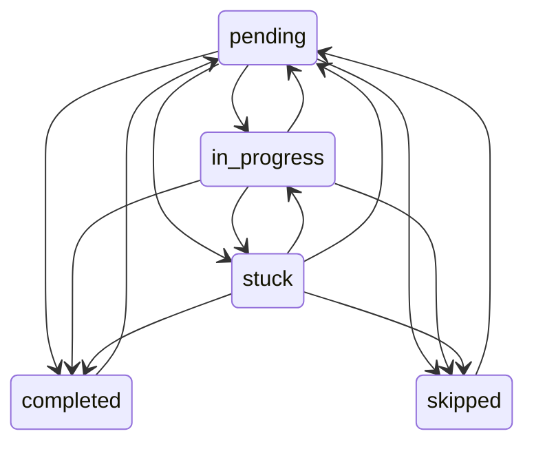

# Entrega 04 — Progresso do Plano

## Contexto

Esta entrega adiciona o domínio de progresso do plano, agenda efetiva, recuperação de dias perdidos, reagendamento, skip, restore, histórico e undo. A UI final da página Plano não foi implementada.

## Problema do app antigo

O app antigo avançava conteúdo a partir da diferença entre data atual e data inicial. A nova regra é: o calendário avança com o tempo, mas o conteúdo só muda depois de uma decisão explícita.

## Agenda Base e Agenda Efetiva

- **Agenda base**: gerada pela Entrega 03 a partir do plano, data inicial e disponibilidade.
- **Agenda efetiva**: combina agenda base, progresso, overrides, skips, conclusões e reagendamentos.

O builder de agenda efetiva fica em `src/lib/domain/progress/effective-schedule.ts`.

## Modelo de Progresso

Cada bloco possui um registro `PlanBlockProgress` com:

- `blockId`;
- `planDayId`;
- `planDaySequence`;
- `status`;
- `originalScheduledDate`;
- `scheduledDate`;
- timestamps de início, conclusão e skip;
- minutos reais;
- dificuldade e confiança em escala 1–5;
- notas e padrão usado.

Reagendamento não é status principal. Um bloco reagendado pode continuar `pending`, `in_progress` ou `stuck`.

## Máquina de Estados



Transições inválidas geram `InvalidProgressTransitionError`.

## Histórico

Ações relevantes geram `ProgressEvent`. Ações em lote usam `actionGroupId`, permitindo desfazer grupos como shift de agenda.

Eventos armazenam `previousProgress` e `nextProgress` para suportar undo sem apagar histórico.

## Cursor do Plano

O item atual é o primeiro bloco não concluído e não pulado na ordem da agenda efetiva. Concluir um bloco futuro fora de ordem não pula pendências anteriores.

## Atraso

Atraso é derivado:

```text
scheduledDate < today
status != completed
status != skipped
```

Não existe status persistido `missed`.

## Reagendamento

`reschedulePlanBlock` preserva `originalScheduledDate`, atualiza `scheduledDate`, cria override e evento. Por padrão bloqueia:

- bloco concluído;
- bloco pulado;
- data de descanso;
- data anterior a hoje.

Dias acima da capacidade são permitidos e retornam warning estruturado.

## Dia Perdido

`handleMissedStudyDay` exige estratégia explícita:

- `keep_overdue`: não altera datas;
- `shift_pending`: move pendentes para próximos dias válidos;
- `reschedule_items`: exige datas por item;
- `skip_items`: marca itens como pulados.

## Shift

`shiftPendingSchedule` move apenas itens `pending`, `in_progress` e `stuck` a partir da data informada. Concluídos e pulados permanecem onde estão.

Domingo não recebe conteúdo quando desabilitado. Dias parcialmente concluídos mantêm blocos concluídos na data original e movem apenas os blocos restantes.

## Skip e Restore

`skipPlanBlock` marca como `skipped`, registra `skippedAt` e histórico. `restoreSkippedPlanBlock` volta para `pending`. Skip não conta como conclusão.

## Undo

`undoProgressAction` desfaz evento individual ou grupo. Ele restaura valores anteriores, remove overrides relacionados e cria evento `undone`.

Se houver ação posterior incompatível para o mesmo bloco, o undo é bloqueado por `CannotUndoProgressActionError`.

## Persistência

Foram adicionadas tabelas:

- `progressEvents`;
- `scheduleOverrides`.

Casos de uso ficam em `src/lib/application/progress` e usam transações Dexie para atualizar progresso, histórico e overrides juntos.

## Limitações

Ainda não há UI final do Plano, Dashboard, Revisar Hoje, revisão espaçada, readiness ou relatórios. Hooks não foram necessários nesta entrega.

## Preparação para Entrega 05

A página Plano deve consumir a agenda efetiva e os casos de uso desta entrega, sem duplicar regras de status, atraso, reagendamento ou cursor.
